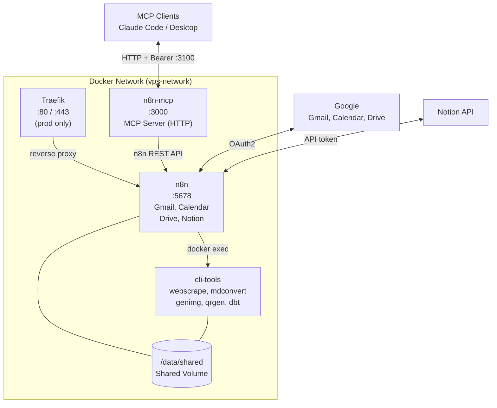

# VPS Stack

Docker Compose setup for running n8n workflow automation with dynamically-loaded CLI tools. Serves as both a personal automation hub and a reusable boilerplate for new projects.

**Use Case**: Run agentic processes on a VPS — personal automations (Gmail, Calendar, Drive, Notion) and custom workflows.

## Features

- **n8n** - Workflow automation platform with OAuth2 support
- **Google Integration** - Gmail, Google Calendar, Google Drive (via built-in n8n nodes)
- **Notion Integration** - Databases, pages, and properties (via built-in n8n node)
- **CLI Tools** - webscrape, mdconvert, genimg, qrgen, dbt (loaded from GitHub)
- **n8n MCP Server** - AI-driven workflow management via [Model Context Protocol](https://github.com/czlonkowski/n8n-mcp)
- **Development mode** - Local access on port 5678
- **Production mode** - SSL via nginx reverse proxy (or Traefik)
- **Dynamic loading** - Tools cloned at startup, auto-update on restart
- **Starter workflows** - Example templates in `workflows/`

## Quick Start

### Development (Local)

```bash
# Run setup (generates secure credentials)
./setup.sh

# Start services
docker-compose up -d

# Access n8n and create owner account
open http://localhost:5678
```

### Production (With SSL)

```bash
# Run production setup
./setup.sh --prod

# Start services
docker-compose -f docker-compose.yml -f docker-compose.prod.yml up -d

# Access n8n at your configured domain and create owner account
# https://n8n.yourdomain.com
```

> **Note**: On first start, n8n requires manual setup of the owner account via the web interface. This cannot be automated via environment variables (as of n8n v1.0+).

## Architecture



## CLI Tools (Dynamically Loaded)

Tools are cloned from GitHub on first container startup:

| Command | Description | Repo |
|---------|-------------|------|
| `webscrape` | Scrape JS-heavy pages | [orbruno/web-scraper-cli](https://github.com/orbruno/web-scraper-cli) |
| `mdconvert` | Markdown to PDF/DOCX | [orbruno/mdconvert-cli](https://github.com/orbruno/mdconvert-cli) |
| `genimg` | AI image generation | [orbruno/image-cli](https://github.com/orbruno/image-cli) |
| `qrgen` | QR code generator | [orbruno/qr-gen-cli](https://github.com/orbruno/qr-gen-cli) |
| `dbt` | Data transformations (PostgreSQL/BigQuery) | [orbruno/dbt-cli](https://github.com/orbruno/dbt-cli) |

### Auto-Update Tools

```bash
# Enable auto-update in .env
CLI_TOOLS_AUTO_UPDATE=true

# Restart container to pull latest
docker-compose restart cli-tools
```

## Using CLI Tools in n8n

In n8n's **Execute Command** node:

```bash
# Scrape website
docker exec cli-tools webscrape scrape "{{ $json.url }}" -o /data/shared/

# Convert Markdown to PDF
docker exec cli-tools mdconvert /files/document.md /data/shared/output.pdf

# Generate QR code
docker exec cli-tools qrgen "{{ $json.url }}" -o /data/shared/qr.png

# Generate AI image (requires GOOGLE_AI_API_KEY)
docker exec cli-tools genimg "{{ $json.prompt }}" -o /data/shared/image.png

# Run dbt transformations (requires profiles.yml in DBT_PROFILES_DIR)
docker exec cli-tools dbt run --profiles-dir /data/shared/dbt --project-dir /data/shared/dbt-project
```

## Shared Volumes

| Volume | n8n Path | cli-tools Path | Purpose |
|--------|----------|----------------|---------|
| shared_data | `/data/shared` | `/data/shared` | Output files |
| local-files | `/files` | `/files` | Host-mounted files |

## Integrations

n8n handles Google and Notion natively via built-in nodes. No additional containers or bridges needed — credentials are configured through n8n's UI.

### Google (Gmail, Calendar, Drive)

1. Create OAuth2 credentials in GCP Console
2. Add redirect URI: `http://localhost:5678/rest/oauth2-credential/callback`
3. In n8n: **Credentials > New > Google OAuth2 API** > paste Client ID & Secret > Connect

Full guide: [docs/google-oauth-setup.md](docs/google-oauth-setup.md)

### Notion

1. Create an integration at [notion.so/my-integrations](https://www.notion.so/my-integrations)
2. Share target pages/databases with the integration
3. In n8n: **Credentials > New > Notion API** > paste token

Full guide: [docs/notion-setup.md](docs/notion-setup.md)

### Starter Workflows

Example workflow templates are in `workflows/`:

| Template | Description |
|----------|-------------|
| `gmail-daily-digest.json` | Daily digest of unread emails |
| `calendar-digest.json` | Morning/evening digest from Google Calendar + Notion |

Push via `./push-workflow.sh workflows/*.json` or import through n8n UI. See [docs/programmatic-workflows.md](docs/programmatic-workflows.md).

## Boilerplate Usage

This stack is designed to be forked for new projects:

```bash
# Clone for a new project
cp -r vps-stack/ my-project-stack/
cd my-project-stack/

# Run setup (configures instance name, credentials, integrations)
./setup.sh

# Start
docker-compose up -d
```

Each instance gets its own Docker volumes, so multiple instances can run side by side on different ports.

## Configuration

### Environment Variables

| Variable | Description | Required |
|----------|-------------|----------|
| `N8N_ENCRYPTION_KEY` | Encryption key for credentials | Yes |
| `N8N_HOST` | Hostname for n8n | Yes |
| `N8N_PROTOCOL` | http or https | Yes |
| `WEBHOOK_URL` | Full webhook URL | Yes |
| `N8N_EDITOR_BASE_URL` | Editor URL (for OAuth2 redirects) | Yes |
| `DOMAIN_NAME` | Domain (production) | Prod only |
| `SUBDOMAIN` | Subdomain (production) | Prod only |
| `SSL_EMAIL` | Let's Encrypt email | Prod only |
| `N8N_MCP_PORT` | n8n MCP server port | Optional (3100) |
| `N8N_MCP_AUTH_TOKEN` | Bearer token for MCP endpoint | For MCP |
| `N8N_MCP_LOG_LEVEL` | MCP server log level | Optional (error) |
| `GOOGLE_AI_API_KEY` | For genimg CLI tool | Optional |
| `CLI_TOOLS_AUTO_UPDATE` | Auto-update tools | Optional |
| `DBT_PROFILES_DIR` | dbt profiles location | Optional |

> **Note**: Owner account credentials are set up manually via the n8n web interface on first launch. There is no environment variable to automate this.

## Directory Structure

```
vps-stack/
├── docker-compose.yml        # Base configuration
├── docker-compose.prod.yml   # Production (Traefik/SSL)
├── .env.example              # Environment template
├── setup.sh                  # Interactive setup script
├── cli-tools-base/           # CLI tools Docker build
│   ├── Dockerfile            # Dependencies only
│   ├── entrypoint.sh         # Clones tools at startup
│   └── cli-tools.yml         # Tool definitions
├── push-workflow.sh          # Push workflows to n8n via API
├── workflows/                # n8n workflow templates
│   ├── gmail-daily-digest.json
│   └── calendar-digest.json
├── local-files/              # Host-mounted files (favicon, index.html)
└── docs/
    ├── KNOWN_ISSUES.md       # Troubleshooting guide
    ├── google-oauth-setup.md # Google OAuth2 setup guide
    ├── notion-setup.md       # Notion API setup guide
    └── programmatic-workflows.md # API workflow management
```

## Commands

```bash
# Development
docker-compose up -d                    # Start
docker-compose down                     # Stop
docker-compose logs -f n8n              # View n8n logs

# Production
docker-compose -f docker-compose.yml -f docker-compose.prod.yml up -d
docker-compose -f docker-compose.yml -f docker-compose.prod.yml down

# Update n8n
docker-compose pull n8n
docker-compose up -d

# Update CLI tools (force re-clone)
docker volume rm cli_tools_repos
docker-compose up -d

# Access CLI tools container
docker exec -it cli-tools bash
```

## Troubleshooting

See [docs/KNOWN_ISSUES.md](docs/KNOWN_ISSUES.md) for common issues.

### GridPane / Nginx Setup

For deploying on GridPane-managed VPS with nginx reverse proxy, see [docs/GRIDPANE_SETUP.md](docs/GRIDPANE_SETUP.md).

### Quick Fixes

```bash
# n8n shows setup screen instead of login
# → Encryption key mismatch. Check docs/KNOWN_ISSUES.md

# CLI tools not executing
docker exec -it cli-tools bash
webscrape --help

# Check shared volume
docker exec n8n ls -la /data/shared
docker exec cli-tools ls -la /data/shared

# Force re-clone tools
docker volume rm cli_tools_repos
docker-compose restart cli-tools
```

## Related Repositories

- [web-scraper-cli](https://github.com/orbruno/web-scraper-cli)
- [mdconvert-cli](https://github.com/orbruno/mdconvert-cli)
- [image-cli](https://github.com/orbruno/image-cli) (genimg)
- [qr-gen-cli](https://github.com/orbruno/qr-gen-cli)
- [dbt-cli](https://github.com/orbruno/dbt-cli) (dbt)

---

**Last Updated**: 2026-02-24
